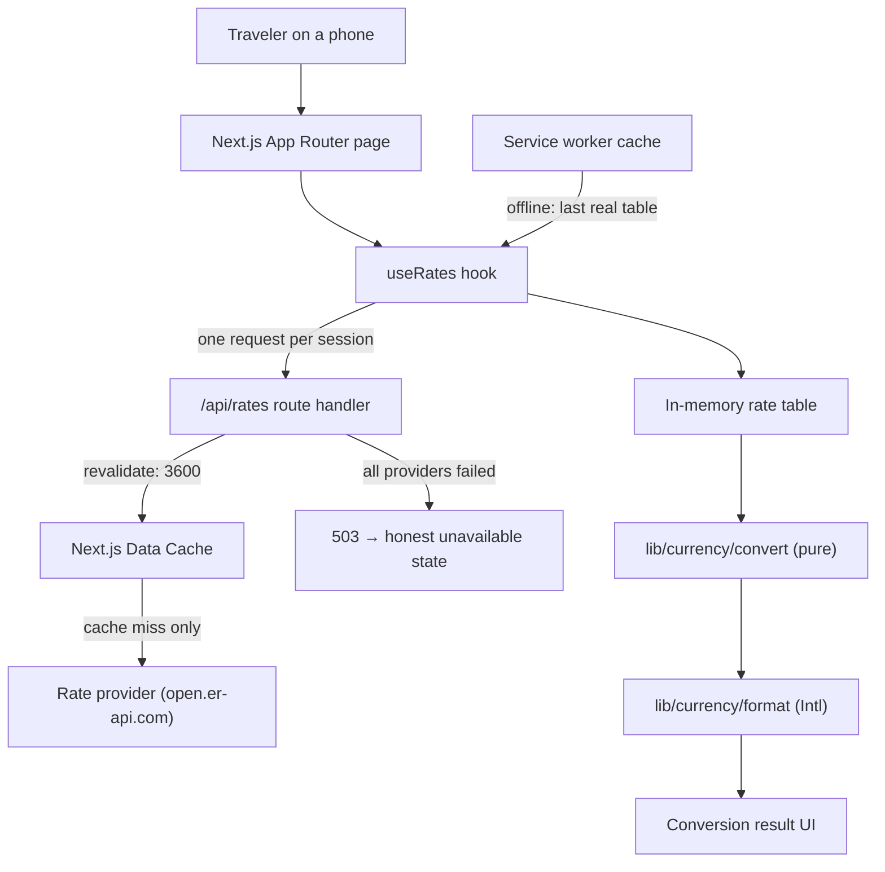
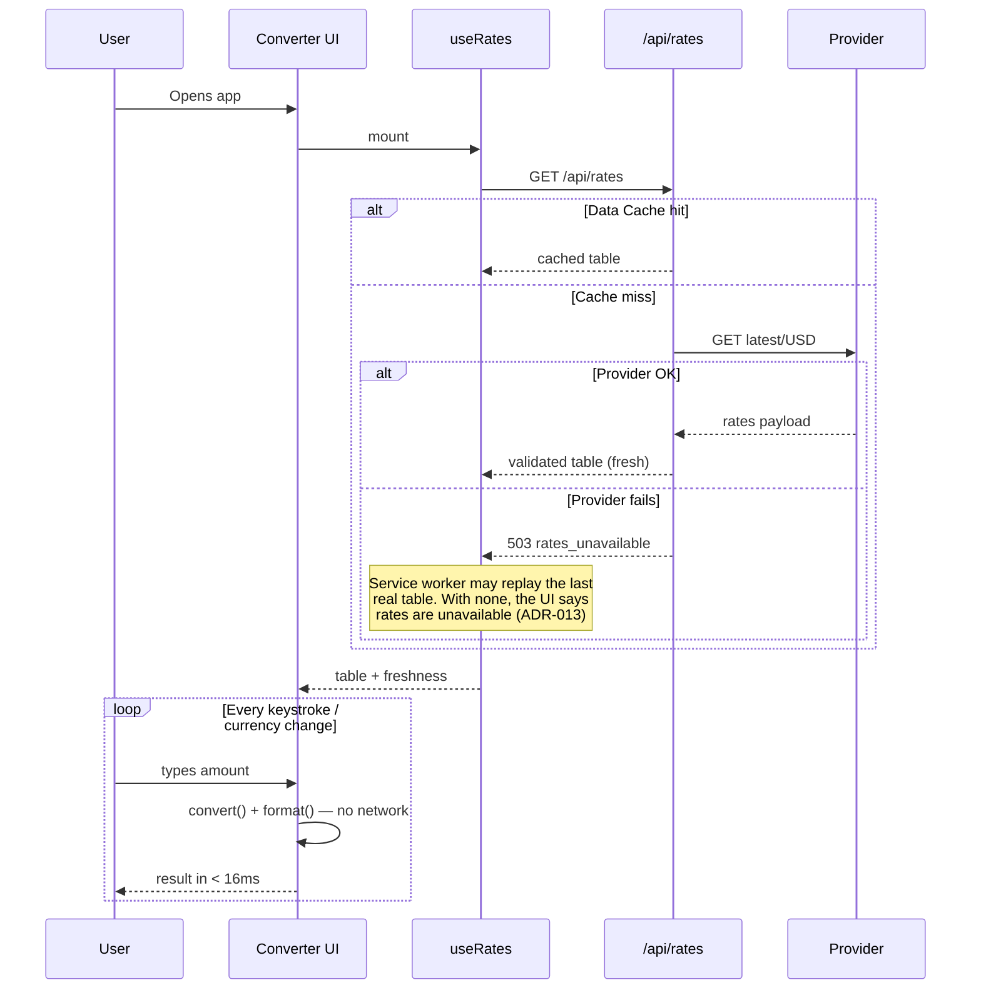

# PriceLens — Architecture

**Status:** Approved for build · **Applies to:** V1 MVP

This document defines _how_ PriceLens is built. It assumes the _what_ from `PRODUCT_REQUIREMENTS.md`
and the _why_ from `PROJECT_BIBLE.md`.

---

## 1. Stack

| Concern         | Choice                                              | Version                            | Note                                      |
| --------------- | --------------------------------------------------- | ---------------------------------- | ----------------------------------------- |
| Framework       | Next.js (App Router)                                | `16.2.12`                          | React Server Components, Route Handlers   |
| Runtime         | React                                               | `19.2.x`                           |                                           |
| Language        | TypeScript                                          | **`^6.0.3`**                       | **Not 7.x** — see ADR-004                 |
| Styling         | Tailwind CSS                                        | `4.3.x`                            | CSS-first config; no `tailwind.config.js` |
| i18n            | next-intl                                           | `4.13.x`                           | ICU messages — see ADR-009                |
| Linting         | ESLint + `eslint-config-next` + `typescript-eslint` | **`9.39.x`** / `16.2.x` / `8.65.x` | **Not 10.x** — see ADR-004                |
| Formatting      | Prettier                                            | `3.9.x`                            |                                           |
| Testing         | Vitest + Testing Library                            | `4.1.x`                            | Runs offline against fixtures             |
| Package manager | pnpm                                                | `10.x`                             |                                           |
| Hosting         | Vercel                                              | —                                  | Zero required environment variables       |

Exact versions are pinned in `package.json` and recorded in `CHANGELOG.md`.

---

## 2. System Overview



The critical property of this diagram: **the loop from user input to visible result never leaves the
browser.** Only the initial table load touches the network.

---

## 3. The Central Decision: One Table, Local Math

The app fetches a **single base-anchored rate table** (base `USD` → every supported currency) once,
then derives any pair locally:

```
rate(from → to) = table[to] / table[from]
result          = amount × rate(from → to)
```

Because `USD → USD = 1`, this identity holds for every pair without a second request, including
pairs that don't involve the base currency at all.

### Why this and not a request per conversion

|                              | One table + local math | Request per conversion     |
| ---------------------------- | ---------------------- | -------------------------- |
| Keystroke latency            | ~0ms (arithmetic)      | 100–800ms + debounce delay |
| Requests per session         | 1                      | 10–40                      |
| Behavior on flaky Wi-Fi      | Fully working          | Broken exactly when needed |
| Provider rate-limit exposure | Negligible             | Real                       |
| Debounce complexity          | None needed            | Required, and user-visible |

The second column is easier to write. The first column is the product. Recorded as **ADR-001**.

### Precision

Triangulating through a base introduces one extra floating-point division. At IEEE-754 double
precision this contributes error around 1e-16 relative — roughly fifteen orders of magnitude below
the smallest displayed unit of any currency. It is irrelevant at display precision, and rounding
happens once, at the very end, using the target currency's real minor-unit digits (ADR-006).

---

## 4. Data Flow



---

## 5. Layers and Boundaries

Boundaries are what make this codebase testable without a browser and changeable without fear.

```
┌──────────────────────────────────────────────┐
│ app/          Routing, layout, route handler │  knows Next.js
├──────────────────────────────────────────────┤
│ components/   Presentation                   │  knows React, not fetch
├──────────────────────────────────────────────┤
│ hooks/        Stateful glue                  │  knows React + services
├──────────────────────────────────────────────┤
│ services/     I/O, providers, validation     │  knows the network, not React
├──────────────────────────────────────────────┤
│ lib/          Pure domain logic              │  knows nothing (by design)
└──────────────────────────────────────────────┘
   config/      Data and settings — a leaf, importable by any layer
```

**Enforced rules:**

- `lib/` imports nothing from `app/`, `components/`, `hooks/`, or `services/`. No fetch, no DOM, no
  React, no `Date.now()` at module scope. Everything in `lib/` is a pure function of its arguments —
  which is precisely why it can be exhaustively unit-tested in milliseconds.
- `components/` never calls `fetch` and never imports from `services/`. Data arrives as props or via
  a hook.
- `services/` never imports React.
- `config/` imports nothing from the app and may be imported by anything. It is data, not behaviour.
- Dependencies point downward only. A violation is a review blocker.

**These rules are enforced by ESLint**, not by review discipline alone: `eslint.config.mjs` applies
`no-restricted-imports` per directory, so a boundary violation fails the build. A rule that lives
only in a document is a rule that erodes.

---

## 6. Folder Structure

```
app/
  layout.tsx                 Root layout, font, metadata
  page.tsx                   The single screen
  globals.css                Tailwind import + @theme design tokens
  api/
    rates/route.ts           Route handler: provider proxy + caching

components/
  ui/                        Design-system primitives, no domain knowledge
    Button.tsx               3 variants × 2 sizes, loading state
    IconButton.tsx           44px circle; `label` required by the type system
    Input.tsx                Label + leading/trailing slots (the capture seam)
    Select.tsx               Searchable combobox; bottom sheet on phones
    Card.tsx
    Skeleton.tsx
    index.ts                 Barrel
  converter/                 Feature composition, domain-aware
    Converter.tsx            Orchestrates the screen; holds the only state
    CountryPicker.tsx        "Which country are you visiting?" (ADR-014)
    CurrencyPicker.tsx       The home-currency side
    ConversionResult.tsx     The visual centrepiece
    ConverterSkeleton.tsx    Loading state, mirrors the real layout
    SwapButton.tsx
    RateFreshness.tsx

    pwa/
      ServiceWorkerRegistrar.tsx  Registers /sw.js after load

config/                      Centralised configuration (ADR-008)
  app.ts                     App settings, cache windows, storage keys
  countries.ts               GENERATED country → currency map — do not hand-edit
  currencies.ts              GENERATED currency metadata — do not hand-edit
  features.ts                Feature flags, including the deliberately-off ones
  i18n.ts                    Locales and formatting tags
  providers.ts               Rate-provider registry and resolution order
  index.ts                   Barrel

lib/
  currency/
    convert.ts               Pure conversion math
    format.ts                Intl-based display formatting
    parse.ts                 User input → number (separator-tolerant)
  utils/
    cn.ts                    Class-name merge (ADR-011)

app/design-system/           Internal component gallery — noindex, unlinked

services/
  rates/
    types.ts                 RateProvider interface, RateTable, RateSnapshot
    exchangerate-api.ts      Live provider (open.er-api.com)
    fixture.ts               Bundled offline snapshot provider
    index.ts                 Provider selection + fallback chain

hooks/
  useRates.ts                Fetch + state for the rate table
  useLocalStorage.ts         SSR-safe persisted state
  useConversion.ts           Derives the result from inputs + table

i18n/
  request.ts                 next-intl request configuration
messages/
  es.json                    Spanish catalogue (the only V1 locale)

types/
  index.ts                   Shared domain types

scripts/
  generate-countries.mjs     Regenerates config/countries.ts
  generate-currencies.mjs    Regenerates config/currencies.ts from ICU
  generate-icons.mjs         Regenerates the PWA icon set

app/manifest.ts              PWA manifest, generated from config
public/sw.js                 Service worker (ADR-007)
public/icons/                GENERATED app icons
tests/                       Test setup and cross-cutting tests
.github/workflows/ci.yml     Format, lint, typecheck, test, build
styles/                      Reserved: tokens if they outgrow globals.css
docs/                        This documentation set
```

Each directory has exactly one responsibility. A file that doesn't clearly belong to one of them is
a signal that a boundary is missing, not that a folder is missing.

**Generated files** (`config/currencies.ts`, `public/icons/*`) are committed so the build needs no
generation step, but they are never hand-edited: change the generator and re-run it. Both generators
are deterministic and reproduce their committed output byte-for-byte.

---

## 6a. Configuration (ADR-008)

Everything tunable lives in `config/`, so changing behaviour is an edit in one place rather than a
search across the codebase:

| File            | Holds                                                                    |
| --------------- | ------------------------------------------------------------------------ |
| `app.ts`        | Base currency, defaults, cache/staleness windows, timeouts, storage keys |
| `currencies.ts` | 156 currencies with name, symbol, minor-unit digits, and region          |
| `features.ts`   | Feature flags — including OCR, AI, and history, all explicitly `false`   |
| `i18n.ts`       | Locale list, default locale, `Intl` formatting tags                      |
| `providers.ts`  | Rate-provider registry and the order they are tried in                   |

`config/` is a leaf: it imports nothing from the app, which is why any layer may import it without
creating a cycle. Its invariants are unit-tested — that the provider chain ends in a fallback, that
defaults name real currencies, that no provider needs an API key, and that `digits` agrees with
`Intl` for all 156 currencies.

---

## 6b. Progressive Web App (ADR-007)

PriceLens is installable and offline-capable from V1, because the connection a traveler has is
usually the problem.

- **`app/manifest.ts`** generates the manifest from `config/` and the message catalogue, so the
  installed app's name can never drift from the UI's.
- **`public/sw.js`** is a hand-written service worker using runtime caching only — no build-time
  precache manifest and therefore no coupling to the bundler.
- **`ServiceWorkerRegistrar`** registers it after `load`, and never in development (a worker holding
  development assets after a rebuild looks exactly like a broken app).

Three strategies, one per kind of request:

| Request          | Strategy               | Why                                            |
| ---------------- | ---------------------- | ---------------------------------------------- |
| Navigations      | Network-first → cache  | Fresh when online, shell when not              |
| `/api/rates`     | Network-first → cache  | Keeps the last good rate table for offline use |
| `/_next/static/` | Stale-while-revalidate | Hashed and immutable; instant on repeat visits |

The service worker's caching of `/api/rates` complements the fixture provider: the fixture guarantees
_a_ result, the cache preserves the _user's most recent real_ rates.

---

## 6c. Internationalisation (ADR-009)

V1 ships Spanish only, but nothing assumes a single locale.

- All UI copy lives in `messages/es.json` — no user-facing string is hardcoded in a component.
- `config/i18n.ts` holds the locale list and formatting tags; `LOCALES` having one entry is a fact
  about today, not an assumption baked into call sites.
- Number and currency formatting goes through `Intl` with an explicit locale, never a hardcoded
  format.
- Adding a locale is: a JSON file, an entry in `LOCALES`, and locale negotiation in
  `i18n/request.ts`. No component changes.

A test compiles every message as ICU and asserts that all catalogues define exactly the same keys, so
a partial translation fails CI rather than showing a raw key to a user.

---

## 6d. Readiness for OCR, AI, and native apps

These are not built (`FEATURES.ocr`, `FEATURES.ai` are `false`), but the structure does not obstruct
them:

- **OCR** is an input method. It produces an amount and a currency — exactly what the converter
  already takes. It plugs in beside the manual input without touching conversion or display.
- **AI/context** consumes a completed conversion and adds interpretation. It sits above the existing
  flow rather than inside it.
- **Native apps** are why `lib/` is framework-agnostic. Pure conversion, parsing, and formatting have
  no React or Next imports — enforced by ESLint — so a React Native client can consume them
  unchanged. `services/` is plain `fetch`, which is portable too.

The readiness is structural, not speculative: no abstraction exists solely to anticipate these.

---

## 7. The Rate Service

### Provider interface

Every provider — live, fixture, or any future replacement — satisfies one contract:

```ts
interface RateProvider {
  readonly id: string;
  fetchRates(base: CurrencyCode): Promise<RateSnapshot>;
}

interface RateSnapshot {
  base: CurrencyCode;
  rates: Readonly<Record<CurrencyCode, number>>;
  fetchedAt: string; // ISO 8601
  source: string; // provider id, surfaced for transparency
  degraded: boolean; // true when this is fallback data
}
```

Swapping providers is a one-file change plus a config line. This matters because free rate APIs
change terms, and we should never be architecturally hostage to one.

### Fallback chain

`services/rates/index.ts` tries providers in order and returns the first success. Today the chain has
one entry — `exchangerate-api` (`open.er-api.com`, keyless, 160+ currencies) — and when it fails,
`resolveRates` throws `RatesUnavailableError` rather than substituting anything.

**There is deliberately no bundled-snapshot provider** (ADR-013). Offline continuity comes from the
service worker replaying the last table the user genuinely received; when there is none, the UI says
rates are unavailable and offers a retry.

### Validation at the boundary

Provider responses are untrusted input. The route handler validates shape and types before the data
enters the app, and rejects the payload wholesale on malformed data rather than letting `undefined`
leak into arithmetic (PRD E9). Currencies present in our metadata but missing from the payload are
excluded from the selectors rather than producing a broken conversion (PRD E12).

### Caching

The route handler uses Next.js Data Cache:

```ts
fetch(providerUrl, { next: { revalidate: 3600 } });
```

One upstream request per hour per deployment, regardless of user count. This is why no database is
needed for caching, and why we can stay comfortably inside a free provider's limits.

---

## 8. Rendering and State

- **Server Components by default.** The layout and static shell render on the server; only the
  interactive converter is a Client Component. This keeps the initial JS payload small
  (PRD: ≤ 100KB gz).
- **State is local and minimal.** Three pieces: `amount`, `fromCurrency`, `toCurrency`, plus the
  fetched table. There is no global store, no context provider, and no reducer — a single screen with
  four values does not need state management, and adding it would be architecture theater.
- **The result is derived, never stored.** `useConversion` computes it from inputs and the table.
  Derived state that gets stored is state that gets stale.
- **No data-fetching library.** SWR or React Query for exactly one request per session would add
  weight and a maintenance obligation to replace a `useEffect` and two state variables (ADR-003).

---

## 9. Error and Degradation Strategy

We degrade rather than fail — but never past the point where the number stops being real. The
hierarchy, in order of preference:

1. **Fresh live rates** — normal operation.
2. **Cached rates** — from Next's Data Cache, or from the service worker when the device is offline.
   These are real rates the user previously received; the UI shows their age.
3. **An honest "rates unavailable" screen** with a retry — when there is nothing real to show.
4. **Never** — a blank screen, a raw error, or **a number nobody fetched**.

The rule underneath all four: **the app never presents data as more current or more real than it
is.** A wrong number shown confidently costs more trust than a missing feature ever could — which is
exactly why step 3 is an error state rather than a bundled snapshot (ADR-013).

Server-side failures are logged with the provider id and status. Client-side, the user sees a plain
sentence, never a stack trace or an error code.

---

## 10. Testing Strategy

| Layer         | Tool                     | What is covered                                                                                                                            |
| ------------- | ------------------------ | ------------------------------------------------------------------------------------------------------------------------------------------ |
| `lib/`        | Vitest                   | Conversion math, parsing, formatting, rounding — including every PRD edge case E3–E7. Exhaustive, because it is cheap and it is the money. |
| `services/`   | Vitest                   | Payload validation, malformed responses, fallback chain ordering                                                                           |
| `hooks/`      | Vitest + Testing Library | Loading, success, degraded, and offline states                                                                                             |
| `components/` | Testing Library          | The primary conversion flow, swap behavior, a11y roles and labels                                                                          |

Tests never touch the network. Provider responses are fixtures, which makes the suite deterministic
and fast — and, usefully, is also the only way it can run in a sandboxed CI environment with
restricted egress.

---

## 11. Deployment

- **Vercel**, connected to the repository. Preview deploy per PR, production on `main`.
- **Zero required environment variables** in V1 — a direct consequence of choosing a keyless
  provider (ADR-002). Cloning the repo and running `pnpm dev` gives a fully working app.
- The route handler runs on the Node.js runtime and the static shell is edge-cached.

---

## 12. Architecture Decision Records

### ADR-001 — One rate table, local triangulation

**Decision.** Fetch a single base-anchored table once per session; compute all pairs client-side.

**Alternatives.** (a) One request per conversion. (b) Server-side conversion on every input change.

**Rationale.** Both alternatives put the network in the keystroke loop. That makes the 3-second
promise dependent on connection quality — and travelers have bad connections by definition. Local
math makes conversion instant, cuts requests by ~95%, removes the need for debouncing, and keeps the
app fully functional offline once loaded.

**Consequences.** We carry a full rate table (~160 floats, a few KB) instead of a single number. We
accept one extra floating-point division per conversion, which is ~15 orders of magnitude below
display precision. Offline capability comes free.

---

### ADR-002 — ExchangeRate-API keyless endpoint as the primary provider

**Decision.** Use `open.er-api.com` as the default live provider.

**Alternatives.** (a) Frankfurter / ECB. (b) A keyed commercial provider.

**Rationale.** Frankfurter is reputable and ECB-sourced, but carries only ~31 currencies and omits
VND, AED, EGP, and most Asian and Middle Eastern destinations — for a _travel_ product, that is a
disqualifying gap, since the currencies it lacks are exactly the ones a traveler is least able to
estimate mentally. A keyed provider offers intraday refresh we do not need at hourly granularity, in
exchange for a signup, a secret, and a deployment prerequisite.

`open.er-api.com` gives 160+ currencies, no key, and no secret to leak. Daily rate updates are
appropriate: mid-market rates move fractions of a percent daily, which is far below the threshold
that changes a "should I buy this scarf" decision.

**Consequences.** Zero-config deploys. Rates are daily, not intraday — acceptable for the use case
and disclosed in the UI. The provider interface means switching later is a one-file change.

---

### ADR-003 — No data-fetching library

**Decision.** A hand-written `useRates` hook rather than SWR or React Query.

**Rationale.** These libraries solve cache invalidation, deduplication, and background refetching
across _many_ endpoints. We have one request, once per session, already cached server-side. The
library would replace roughly twenty lines with a permanent dependency, bundle weight against a
100KB budget, and an upgrade obligation.

**Consequences.** We own ~20 lines of fetch-and-state code. If V2 introduces multiple endpoints or
real-time refresh, revisiting this is a contained change confined to one hook.

---

### ADR-004 — Pin the toolchain to what the ecosystem supports, not to `latest`

**Decision.** Pin `typescript@^6.0.3` (not 7.x) and `eslint@^9.39.1` (not 10.x).

**Rationale.** "Use the latest version" is a good default that fails badly at the edge of a release
cycle. Two concrete cases, both verified rather than assumed:

- npm `latest` for TypeScript is `7.0.2`, but `typescript-eslint@8.65.0` declares a peer range of
  `>=4.8.4 <6.1.0`. Installing it would silently break type-aware linting — a main quality gate — on
  day one. `6.0.3` is the newest version inside the supported range.
- ESLint `10.8.0` installs cleanly and then **fails at runtime**: `eslint-plugin-react@7.37.5`, a
  transitive dependency of `eslint-config-next`, calls a rule-context API that ESLint 10 removed
  (`TypeError: contextOrFilename.getFilename is not a function`). `9.39.x` lints clean.

The second case is the instructive one: the peer ranges _permitted_ ESLint 10, and the incompatibility
only appeared when the linter actually ran. Dependency metadata is a claim, not a guarantee.

**Consequences.** We are deliberately one major behind on two tools. This ADR exists so a future
contributor bumping them understands it is a constraint, not neglect. Before either upgrade, run the
tool — not just the install. TypeScript unblocks when `typescript-eslint` widens its peer range;
ESLint unblocks when `eslint-plugin-react` supports 10.

---

### ADR-007 — A hand-written service worker, not a PWA framework

**Decision.** Ship a ~120-line runtime-caching service worker in `public/sw.js` rather than adopting
`@serwist/next` or `next-pwa`.

**Alternatives.** (a) `@serwist/next` — maintained, generates a build-time precache manifest.
(b) `next-pwa` — effectively unmaintained.

**Rationale.** The genuine difficulty in a service worker is precaching hashed build assets, whose
names are unknown at author time. **Runtime caching sidesteps that entirely**: assets are cached as
they are requested, so filenames never need to be known in advance. That removes the main reason to
take the dependency.

Against taking it: Serwist's peer range predates Next 16 and it hooks the bundler, while Next 16
defaults to Turbopack — a compatibility risk on the critical path of the build, on a brand-new major.
A worker with zero build integration cannot break the build.

**Consequences.** We own ~120 lines of well-understood cache code. The trade-off to be honest about:
without a precache manifest, the first visit does not pre-populate the cache, so full offline support
begins after the first successful load rather than immediately on install. For a single-screen app
this means "works offline after you've opened it once" — adequate, and verified in a real browser
with the network disabled. If richer offline behaviour is needed (V2 offline rate packs), revisit
Serwist then, when Next 16 support is settled.

---

### ADR-008 — Centralised configuration in `config/`

**Decision.** All currencies, providers, feature flags, locales, and app settings live in `config/`,
which imports nothing from the rest of the app.

**Rationale.** Configuration scattered as literals across a codebase is the reason "change the
default currency" turns into a grep. Collecting it makes behaviour changes a single edit, and makes
the settings **testable as data** — the provider chain always ending in a fallback is an invariant a
unit test can hold, rather than a property nobody notices breaking.

Keeping `config/` free of app imports is what lets every layer use it without creating a cycle,
including pure `lib/` code.

**Consequences.** One more directory, and a rule that literals belong in config. `currencies.ts` is
generated rather than hand-written, so a stale ICU assumption is a re-run rather than an audit.

---

### ADR-009 — next-intl for i18n, with Spanish as the only V1 locale

**Decision.** Use `next-intl` with all copy in `messages/es.json`.

**Alternatives.** (a) Hardcode Spanish now, extract later. (b) A hand-rolled dictionary and `t()`.

**Rationale.** (a) is how products end up with a six-week i18n project: extracting strings after the
fact means touching every component. The cost of routing copy through a catalogue now is nearly zero;
the cost of retrofitting it is not.

(b) is tempting for ~30 strings, but the moment a message needs plurals — `hace 1 minuto` vs
`hace 5 minutos`, which the rate-freshness UI needs — it means implementing ICU plural rules per
locale. That is meaningfully hard to do correctly, which is exactly our bar for taking a dependency.
next-intl also officially supports Next 16 and works in both Server and Client Components.

**Consequences.** One dependency. V1 has no locale routing and no middleware — the locale resolves to
the default — so the setup stays small. Adding a locale is a JSON file plus negotiation in
`i18n/request.ts`, with no call-site changes.

---

### ADR-010 — Structural readiness for OCR, AI, and native, with nothing built

**Decision.** Keep `lib/` framework-agnostic and enforce it with lint rules, but add no abstraction
whose only purpose is a future feature.

**Rationale.** "Ready for the future" usually means speculative interfaces that turn out to fit the
future badly, and cost maintenance in the meantime. The version that works is keeping the domain core
free of framework dependencies — which we want anyway, for testability.

That single property is what makes the future features tractable: OCR is an input method producing an
amount and a currency the converter already accepts; AI context consumes a finished conversion; a
native client can import the same pure `lib/` modules. Feature flags in `config/features.ts` name
these seams without implementing them.

**Consequences.** No speculative code. The readiness claim is checkable: if `lib/` ever imports React,
lint fails.

---

### ADR-011 — `clsx` + `tailwind-merge` for class composition

**Decision.** Compose class names through a `cn()` helper built on `clsx` and `tailwind-merge`.

**Alternatives.** (a) `classes.filter(Boolean).join(' ')`. (b) A variant library such as `cva`.

**Rationale.** (a) looks sufficient and is quietly broken for a component library. Tailwind emits
utilities in a fixed stylesheet order, so `class="p-2 p-4"` does not reliably resolve to `p-4` — the
rule appearing later in the CSS wins, regardless of attribute order. Any component that accepts a
`className` override therefore has unpredictable overrides. `tailwind-merge` removes the losing
utility outright, which is a correctness fix, not a convenience.

(b) is declined: variant maps are plain objects here, and a library to look up a string in a record
is not worth a dependency.

**Consequences.** Two small dependencies (~8KB combined) against a 100KB budget. A unit test asserts
that a caller-supplied `bg-danger-600` actually displaces the variant's `bg-primary-600`, so the
behaviour this ADR buys is checked rather than assumed.

---

### ADR-012 — Capture readiness through slots, not scaffolding

**Decision.** Make future OCR/camera capture integrable through existing component seams — `Input`'s
`trailing` slot, `IconButton`, and the bottom-sheet pattern — and build none of it.

**Rationale.** "Prepare for a feature" usually produces abstractions designed against an imagined
version of that feature, which then fit the real one badly while costing maintenance in between.

The version that works is noticing what capture actually needs from the UI: a trigger inside the
amount row, a full-screen surface, a loading state, and an error state. All four are ordinary
requirements that the design system needs anyway, so meeting them costs nothing extra and commits us
to nothing.

**Consequences.** No capture code, no permission flow, no unused abstraction — `FEATURES.ocr` stays
`false`. The seam is exercised today (the gallery renders a camera `IconButton` in the trailing slot)
and asserted by a test, so "no redesign required" is a claim that fails loudly if it stops being
true.

---

### ADR-014 — Country-first selection

**Decision.** The primary selector asks **which country you are visiting**, not which currency you
need. The currency is derived from the country.

**Alternatives.** (a) Currency-first, with country names as search keywords (what Phases 3–4
shipped). (b) Both selectors offered side by side.

**Rationale.** A currency selector asks the traveler to translate their situation into a code before
the app can help: _I am in Thailand → Thailand uses the baht → the baht is THB → select THB._ Three
steps of translation, every one of which the app could have done for them. Country-first does the
translation: _I am in Thailand → select Thailand._

This is the same instinct as ADR-001, applied to the interface rather than the network: do the work
in the product so the user does not have to. It is also why the currency badge next to the amount was
removed — the country already determines the currency, and showing the code twice is the same
information competing with itself on the screen the user reads fastest.

(b) was rejected because two selectors for one concept is exactly the clutter this product is
defined against.

**Consequences.** A curated ISO 3166 → ISO 4217 mapping is now part of the product's data
(`config/countries.ts`, 195 countries). Unlike exchange rates this is stable reference data a
reviewer can verify row by row, and a test asserts every country maps to a currency the app can
actually convert.

Two facts had to be handled: several countries share a currency (twenty use the euro), so
`countryForCurrency` names an explicit representative for the swap to land on; and some countries use
a currency that is not their own (Ecuador and El Salvador use USD), which the mapping captures
correctly. Currency-level search still works — the picker matches on code and currency name too, for
the traveler who does know.

The home side stays a **currency** picker: you know your own currency, and it is the value we
remember between visits.

---

### ADR-013 — No bundled fallback rates; fail honestly instead

**Supersedes** the fixture-provider element of ADR-002.

**Decision.** Ship no snapshot of exchange rates. When every provider fails and no cached table
exists, show an explicit "rates unavailable" state with a retry.

**Alternatives.** (a) Commit a dated snapshot as a last-resort provider, labelled "approximate".
(b) Fall back to a small set of major-currency rates.

**Rationale.** The original design called for a bundled fixture, and it was wrong for a reason worth
recording: **we have no source of real rate data at build time.** Any committed table would be
numbers someone made up, and to a traveler standing in a shop they would be indistinguishable from
rates we fetched — same typography, same confident presentation, on the screen they are using to
decide whether to spend money.

Labelling them "approximate" does not fix this. A user who sees `฿1,890 = €48` has already made the
decision by the time they read the caption, and a caption cannot un-anchor a number.

This is the direct application of Value #4 in `PROJECT_BIBLE.md`: honesty about uncertainty. "Handle
errors gracefully" means degrading in a way the user can reason about — not manufacturing data to
avoid an empty state.

**Consequences.** A first-ever visit while completely offline shows an error rather than a
conversion. That is the honest outcome, and it is narrow: after one successful load the service
worker holds a real table, which covers the actual travel scenario (connection lost _during_ a trip).
`PROVIDER_CHAIN` still supports multiple providers, so adding a second _real_ source later is a
config entry. If a genuine offline dataset is ever licensed, it can be added as a provider with a
real `fetchedAt` — the interface already allows it.

---

### ADR-005 — `localStorage` for home currency only

**Decision.** Persist the home currency, and nothing else, to `localStorage`.

**Rationale.** V1 forbids databases, accounts, and history. A single device-local preference key is
none of those: no PII, no server state, no record over time. It exists because re-selecting your home
currency on every visit is a direct tax on the 3-second promise, and the home currency is the one
value that genuinely does not change between trips.

The foreign currency is deliberately **not** persisted — it changes per country, and restoring a
stale value would be worse than restoring nothing.

**Consequences.** The boundary is written down here so that "we already use localStorage" can never
be used to justify history, analytics, or session state. Any extension of stored data requires a new
ADR. Storage failures (private mode, disabled storage) degrade silently to session-only.

---

### ADR-006 — Currency-aware rounding, not fixed two decimals

**Decision.** Round using each currency's real minor-unit digits, sourced from static metadata and
rendered via `Intl.NumberFormat`.

**Rationale.** Hardcoding two decimals is wrong for a meaningful share of travel currencies: JPY,
KRW, and VND have zero minor units (`¥1,340`, never `¥1,340.00`), while KWD, BHD, and OMR have three.
Getting this wrong looks amateurish in exactly the destinations where the user is least equipped to
notice the error — which makes it a trust problem, not a formatting problem.

Additionally, results below the smallest unit must show meaningful precision: `$0.0031` is useful,
`$0.00` is a falsehood (PRD E7).

**Consequences.** Currency metadata must carry a `digits` field per currency. Rounding happens once,
at display time, never mid-calculation. All of this is unit-tested.

---

### ADR-015 — Detect the home currency from device settings, never from geolocation

**Decision.** Guess a first-time visitor's home currency from the device's locale region subtag,
falling back to the IANA timezone. The Geolocation API is **not** used, and no permission is ever
requested.

**Rationale.** Two independent reasons, either of which would be sufficient.

The first is cost. A permission prompt on first paint is the most expensive interaction in the app,
and it lands before the user has seen anything worth granting it for. The product promises a price
understood in three seconds; a modal dialog is not part of that.

The second is correctness, and it is the more interesting one. Geolocation answers _where is this
phone right now_ — which, for the audience this product exists to serve, is the country whose prices
they are trying to understand, not the currency they think in. A traveler in Bangkok wants baht
converted **into** their own currency, and geolocation would confidently supply the wrong side of
that conversion. The locale region comes from the OS region setting and does not move when its owner
does, which is exactly the property a _home_ currency needs.

The timezone is the weaker second signal, used only when the locale carries no region (`es`, `en`).
It does follow the phone across borders, so it is wrong for the same reason geolocation is — but it
is free, and being wrong occasionally beats defaulting every unrecognised visitor to euros.

`Intl.Locale.maximize()` is deliberately not used. Turning a bare `en` into `en-Latn-US` is CLDR's
most-likely-subtags guess, not information about this user; silently selecting US dollars for every
English speaker on that basis would be worse than the honest default.

**Consequences.**

- Detection runs **once**, on a visit with nothing stored. A stored currency — chosen or previously
  detected — is never overridden. Re-detecting would fight the user's own choice, which is the
  failure mode that makes this class of feature resented.
- The timezone table is generated from tzdata (`zone1970.tab`, `zone.tab`) rather than hand-written,
  and is loaded through a dynamic import, so the ~10KB chunk is fetched only by the minority of
  devices whose locale carries no region.
- Engines disagree on which timezone spelling is canonical — Node's ICU resolves `Asia/Kolkata` _to_
  `Asia/Calcutta`, the reverse of what browsers do — so the table carries both spellings and the
  lookup tries the reported name before any canonicalisation.
- **No new data is stored.** The detected value is written to the same single key ADR-005 already
  permits, holding the same kind of value. The storage boundary is unchanged.
- Detection failing, throwing, or naming a currency with no rate all leave the configured default in
  place. The feature can only improve on the default or do nothing.
- Behind `FEATURES.detectHomeCurrency`; turning it off restores the previous behaviour exactly.
