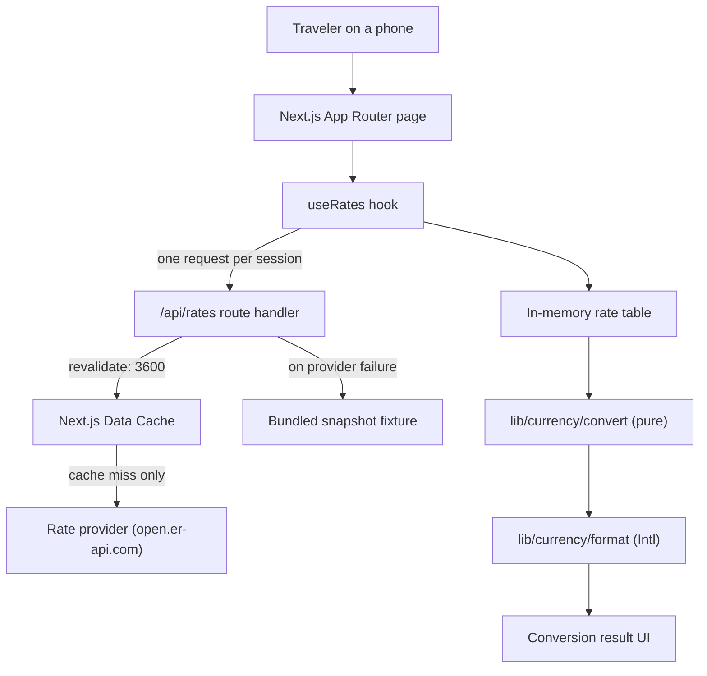
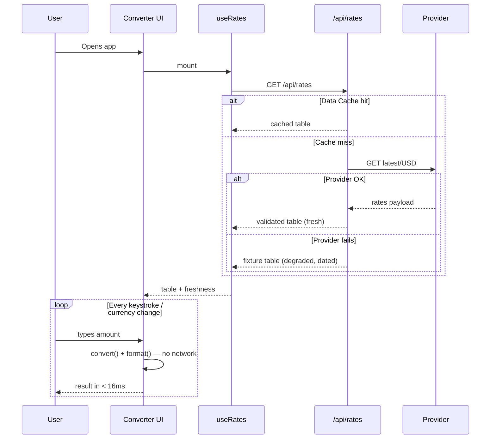

# PriceLens — Architecture

**Status:** Approved for build · **Applies to:** V1 MVP

This document defines *how* PriceLens is built. It assumes the *what* from `PRODUCT_REQUIREMENTS.md`
and the *why* from `PROJECT_BIBLE.md`.

---

## 1. Stack

| Concern | Choice | Version | Note |
| --- | --- | --- | --- |
| Framework | Next.js (App Router) | `16.2.x` | React Server Components, Route Handlers |
| Runtime | React | `19.2.x` | |
| Language | TypeScript | **`^6.0.3`** | **Not 7.x** — see ADR-004 |
| Styling | Tailwind CSS | `4.3.x` | CSS-first config; no `tailwind.config.js` |
| Linting | ESLint + `eslint-config-next` + `typescript-eslint` | `10.x` / `16.2.x` / `8.65.x` | Type-aware rules |
| Formatting | Prettier | `3.9.x` | |
| Testing | Vitest + Testing Library | `4.1.x` | Runs offline against fixtures |
| Package manager | pnpm | `10.x` | |
| Hosting | Vercel | — | Zero required environment variables |

Exact versions are pinned in Phase 2 and recorded in `CHANGELOG.md`.

---

## 2. System Overview



The critical property of this diagram: **the loop from user input to visible result never leaves the
browser.** Only the initial table load touches the network.

---

## 3. The Central Decision: One Table, Local Math

The app fetches a **single base-anchored rate table** (base `USD` → every supported currency) once,
then derives any pair locally:

```
rate(from → to) = table[to] / table[from]
result          = amount × rate(from → to)
```

Because `USD → USD = 1`, this identity holds for every pair without a second request, including
pairs that don't involve the base currency at all.

### Why this and not a request per conversion

| | One table + local math | Request per conversion |
| --- | --- | --- |
| Keystroke latency | ~0ms (arithmetic) | 100–800ms + debounce delay |
| Requests per session | 1 | 10–40 |
| Behavior on flaky Wi-Fi | Fully working | Broken exactly when needed |
| Provider rate-limit exposure | Negligible | Real |
| Debounce complexity | None needed | Required, and user-visible |

The second column is easier to write. The first column is the product. Recorded as **ADR-001**.

### Precision

Triangulating through a base introduces one extra floating-point division. At IEEE-754 double
precision this contributes error around 1e-16 relative — roughly fifteen orders of magnitude below
the smallest displayed unit of any currency. It is irrelevant at display precision, and rounding
happens once, at the very end, using the target currency's real minor-unit digits (ADR-006).

---

## 4. Data Flow



---

## 5. Layers and Boundaries

Boundaries are what make this codebase testable without a browser and changeable without fear.

```
┌──────────────────────────────────────────────┐
│ app/          Routing, layout, route handler │  knows Next.js
├──────────────────────────────────────────────┤
│ components/   Presentation                   │  knows React, not fetch
├──────────────────────────────────────────────┤
│ hooks/        Stateful glue                  │  knows React + services
├──────────────────────────────────────────────┤
│ services/     I/O, providers, validation     │  knows the network, not React
├──────────────────────────────────────────────┤
│ lib/          Pure domain logic              │  knows nothing (by design)
└──────────────────────────────────────────────┘
```

**Enforced rules:**

- `lib/` imports nothing from `app/`, `components/`, `hooks/`, or `services/`. No fetch, no DOM, no
  React, no `Date.now()` at module scope. Everything in `lib/` is a pure function of its arguments —
  which is precisely why it can be exhaustively unit-tested in milliseconds.
- `components/` never calls `fetch` and never imports from `services/`. Data arrives as props or via
  a hook.
- `services/` never imports React.
- Dependencies point downward only. A violation is a review blocker.

---

## 6. Folder Structure

```
app/
  layout.tsx                 Root layout, font, metadata
  page.tsx                   The single screen
  globals.css                Tailwind import + @theme design tokens
  api/
    rates/route.ts           Route handler: provider proxy + caching

components/
  ui/                        Design-system primitives, no domain knowledge
    Button.tsx
    Input.tsx
    Select.tsx               Searchable listbox
    Card.tsx
    Skeleton.tsx
  converter/                 Feature composition, domain-aware
    Converter.tsx            Orchestrates the screen
    AmountInput.tsx
    CurrencyPicker.tsx
    ConversionResult.tsx     The visual centerpiece
    SwapButton.tsx
    RateFreshness.tsx

lib/
  currency/
    convert.ts               Pure conversion math
    format.ts                Intl-based display formatting
    parse.ts                 User input → number (separator-tolerant)
    currencies.ts            Static metadata: code, name, symbol, digits, country
  utils/
    cn.ts                    Class-name merge helper

services/
  rates/
    types.ts                 RateProvider interface, RateTable, RateSnapshot
    exchangerate-api.ts      Live provider (open.er-api.com)
    fixture.ts               Bundled offline snapshot provider
    index.ts                 Provider selection + fallback chain

hooks/
  useRates.ts                Fetch + state for the rate table
  useLocalStorage.ts         SSR-safe persisted state
  useConversion.ts           Derives the result from inputs + table

types/
  index.ts                   Shared domain types

public/                      Static assets
styles/                      Reserved: tokens if they outgrow globals.css
docs/                        This documentation set
```

Each directory has exactly one responsibility. A file that doesn't clearly belong to one of them is
a signal that a boundary is missing, not that a folder is missing.

---

## 7. The Rate Service

### Provider interface

Every provider — live, fixture, or any future replacement — satisfies one contract:

```ts
interface RateProvider {
  readonly id: string;
  fetchRates(base: CurrencyCode): Promise<RateSnapshot>;
}

interface RateSnapshot {
  base: CurrencyCode;
  rates: Readonly<Record<CurrencyCode, number>>;
  fetchedAt: string;   // ISO 8601
  source: string;      // provider id, surfaced for transparency
  degraded: boolean;   // true when this is fallback data
}
```

Swapping providers is a one-file change plus a config line. This matters because free rate APIs
change terms, and we should never be architecturally hostage to one.

### Fallback chain

`services/rates/index.ts` tries providers in order and returns the first success:

1. **`exchangerate-api`** — `open.er-api.com`, keyless, 160+ currencies, daily refresh.
2. **`fixture`** — a dated snapshot committed to the repo. Always succeeds. Returns `degraded: true`.

The fixture provider is not a testing convenience — it is a **production reliability component**.
It guarantees the app renders a useful answer with the provider entirely unreachable
(PRD requirement FR-5, E10, E11), and it is what makes the app work offline.

### Validation at the boundary

Provider responses are untrusted input. The route handler validates shape and types before the data
enters the app, and rejects the payload wholesale on malformed data rather than letting `undefined`
leak into arithmetic (PRD E9). Currencies present in our metadata but missing from the payload are
excluded from the selectors rather than producing a broken conversion (PRD E12).

### Caching

The route handler uses Next.js Data Cache:

```ts
fetch(providerUrl, { next: { revalidate: 3600 } })
```

One upstream request per hour per deployment, regardless of user count. This is why no database is
needed for caching, and why we can stay comfortably inside a free provider's limits.

---

## 8. Rendering and State

- **Server Components by default.** The layout and static shell render on the server; only the
  interactive converter is a Client Component. This keeps the initial JS payload small
  (PRD: ≤ 100KB gz).
- **State is local and minimal.** Three pieces: `amount`, `fromCurrency`, `toCurrency`, plus the
  fetched table. There is no global store, no context provider, and no reducer — a single screen with
  four values does not need state management, and adding it would be architecture theater.
- **The result is derived, never stored.** `useConversion` computes it from inputs and the table.
  Derived state that gets stored is state that gets stale.
- **No data-fetching library.** SWR or React Query for exactly one request per session would add
  weight and a maintenance obligation to replace a `useEffect` and two state variables (ADR-003).

---

## 9. Error and Degradation Strategy

We degrade rather than fail. The hierarchy, in order of preference:

1. **Fresh live rates** — normal operation.
2. **Cached rates** — served from the Data Cache; user sees the fetch timestamp.
3. **Fixture rates** — provider down or unreachable; clearly labeled as approximate and dated.
4. **Never** — a blank screen, a raw error, or a number with no indication of its provenance.

The rule underneath all four: **the app never presents degraded data as if it were live.** A wrong
number shown confidently costs more trust than a missing feature ever could.

Server-side failures are logged with the provider id and status. Client-side, the user sees a plain
sentence, never a stack trace or an error code.

---

## 10. Testing Strategy

| Layer | Tool | What is covered |
| --- | --- | --- |
| `lib/` | Vitest | Conversion math, parsing, formatting, rounding — including every PRD edge case E3–E7. Exhaustive, because it is cheap and it is the money. |
| `services/` | Vitest | Payload validation, malformed responses, fallback chain ordering |
| `hooks/` | Vitest + Testing Library | Loading, success, degraded, and offline states |
| `components/` | Testing Library | The primary conversion flow, swap behavior, a11y roles and labels |

Tests never touch the network. Provider responses are fixtures, which makes the suite deterministic
and fast — and, usefully, is also the only way it can run in a sandboxed CI environment with
restricted egress.

---

## 11. Deployment

- **Vercel**, connected to the repository. Preview deploy per PR, production on `main`.
- **Zero required environment variables** in V1 — a direct consequence of choosing a keyless
  provider (ADR-002). Cloning the repo and running `pnpm dev` gives a fully working app.
- The route handler runs on the Node.js runtime and the static shell is edge-cached.

---

## 12. Architecture Decision Records

### ADR-001 — One rate table, local triangulation

**Decision.** Fetch a single base-anchored table once per session; compute all pairs client-side.

**Alternatives.** (a) One request per conversion. (b) Server-side conversion on every input change.

**Rationale.** Both alternatives put the network in the keystroke loop. That makes the 3-second
promise dependent on connection quality — and travelers have bad connections by definition. Local
math makes conversion instant, cuts requests by ~95%, removes the need for debouncing, and keeps the
app fully functional offline once loaded.

**Consequences.** We carry a full rate table (~160 floats, a few KB) instead of a single number. We
accept one extra floating-point division per conversion, which is ~15 orders of magnitude below
display precision. Offline capability comes free.

---

### ADR-002 — ExchangeRate-API keyless endpoint as the primary provider

**Decision.** Use `open.er-api.com` as the default live provider.

**Alternatives.** (a) Frankfurter / ECB. (b) A keyed commercial provider.

**Rationale.** Frankfurter is reputable and ECB-sourced, but carries only ~31 currencies and omits
VND, AED, EGP, and most Asian and Middle Eastern destinations — for a *travel* product, that is a
disqualifying gap, since the currencies it lacks are exactly the ones a traveler is least able to
estimate mentally. A keyed provider offers intraday refresh we do not need at hourly granularity, in
exchange for a signup, a secret, and a deployment prerequisite.

`open.er-api.com` gives 160+ currencies, no key, and no secret to leak. Daily rate updates are
appropriate: mid-market rates move fractions of a percent daily, which is far below the threshold
that changes a "should I buy this scarf" decision.

**Consequences.** Zero-config deploys. Rates are daily, not intraday — acceptable for the use case
and disclosed in the UI. The provider interface means switching later is a one-file change.

---

### ADR-003 — No data-fetching library

**Decision.** A hand-written `useRates` hook rather than SWR or React Query.

**Rationale.** These libraries solve cache invalidation, deduplication, and background refetching
across *many* endpoints. We have one request, once per session, already cached server-side. The
library would replace roughly twenty lines with a permanent dependency, bundle weight against a
100KB budget, and an upgrade obligation.

**Consequences.** We own ~20 lines of fetch-and-state code. If V2 introduces multiple endpoints or
real-time refresh, revisiting this is a contained change confined to one hook.

---

### ADR-004 — Pin TypeScript to `^6.0.3`, not `latest`

**Decision.** Pin `typescript@^6.0.3` and do not upgrade to 7.x until tooling catches up.

**Rationale.** At the time of writing, npm `latest` for TypeScript is `7.0.2`, but
`typescript-eslint@8.65.0` declares a peer range of `>=4.8.4 <6.1.0`. Installing "the latest" would
silently break type-aware linting — one of our main quality gates — on the first day of the project.
`6.0.3` is the newest version inside the supported range.

**Consequences.** We are one major version behind `latest` by design. This ADR exists so that a
future contributor bumping the version understands it is a deliberate constraint, not neglect. The
upgrade unblocks when `typescript-eslint` widens its peer range; re-verify with
`npm view typescript-eslint peerDependencies` before bumping.

---

### ADR-005 — `localStorage` for home currency only

**Decision.** Persist the home currency, and nothing else, to `localStorage`.

**Rationale.** V1 forbids databases, accounts, and history. A single device-local preference key is
none of those: no PII, no server state, no record over time. It exists because re-selecting your home
currency on every visit is a direct tax on the 3-second promise, and the home currency is the one
value that genuinely does not change between trips.

The foreign currency is deliberately **not** persisted — it changes per country, and restoring a
stale value would be worse than restoring nothing.

**Consequences.** The boundary is written down here so that "we already use localStorage" can never
be used to justify history, analytics, or session state. Any extension of stored data requires a new
ADR. Storage failures (private mode, disabled storage) degrade silently to session-only.

---

### ADR-006 — Currency-aware rounding, not fixed two decimals

**Decision.** Round using each currency's real minor-unit digits, sourced from static metadata and
rendered via `Intl.NumberFormat`.

**Rationale.** Hardcoding two decimals is wrong for a meaningful share of travel currencies: JPY,
KRW, and VND have zero minor units (`¥1,340`, never `¥1,340.00`), while KWD, BHD, and OMR have three.
Getting this wrong looks amateurish in exactly the destinations where the user is least equipped to
notice the error — which makes it a trust problem, not a formatting problem.

Additionally, results below the smallest unit must show meaningful precision: `$0.0031` is useful,
`$0.00` is a falsehood (PRD E7).

**Consequences.** Currency metadata must carry a `digits` field per currency. Rounding happens once,
at display time, never mid-calculation. All of this is unit-tested.
